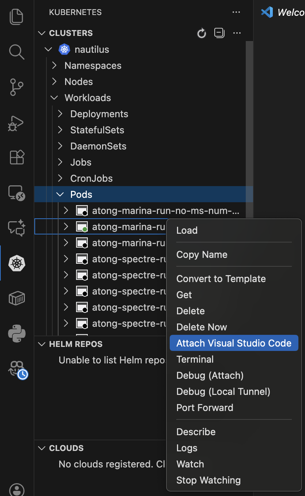

# GURU SMART Project Research Configs

To use compute resources, follow this guide in order to access the NRP platform:

## Initial steps and policies
1. Log in to [NRP](https://nrp.ai/) and sign up for an account if you don't have one.
2. Once you have been added to the `guru-research` namespace, you should be good to start using the cluster! Install `kubectl`, the commandline tool for accessing kubernetes clusters, with instructions [here](https://kubernetes.io/docs/tasks/tools/). The documentation for NRP is [here](https://nrp.ai/documentation/).
3. Please familiarize yourself with the structure of kubernetes and user policies [here](https://nrp.ai/documentation/userdocs/start/policies/). There are 3 primary "compute methods": jobs, pods, and deployments. In general, we won't really use deployments. Pods are generally for interactive code development, and jobs are batch compute requests that are noninteractive.
4. Pods are limited to a maximum of 6 hours, 2 GPUs, 16 CPUs, and 32GB RAM. These interactive pods are not really subject to the compute requirements (you can have it sit idle, but try to clean up your pods if you are not using them!)
5. For jobs, you will need to ensure that your job is using enough CPU, GPU, and RAM. This is usually not an issue if you are just finetuning the SMART code since it's already configured to be within these limits.

## Start your first pod
The following practices mostly apply to Unix systems (MacOS / Linux). If you run Windows only, they are all doable, but you should tweak the commands as needed.
1. View the cluster access via `kubectl` info [here](https://nrp.ai/documentation/userdocs/start/getting-started/#cluster-access-via-kubectl). You'll need to install `kubelogin`, a plugin to manage authentication into the NRP cluster. I recommend either using `homebrew` to install it, or if you are on Windows you should install Krew first [here](https://krew.sigs.k8s.io/docs/user-guide/setup/install/), and then you can install `kubelogin` from either method [here](https://github.com/int128/kubelogin?tab=readme-ov-file#setup). If you have issues setting it up, ask me for help.
2. Read through the rest of the cluster access instructions, and follow it as necessary. You should execute
```
kubectl config set contexts.nautilus.namespace guru-research
```
to set `guru-research` as the default namespace.
3. You're now ready to get your own resources. First, you'll need to create a PVC, which is storage that persists across sessions and machines. Create a new yaml file in the `volumes/` folder, you can name it whatever you like (please choose something with your name in it so we can trace it back to you). Here is the template:
```yaml
apiVersion: v1
kind: PersistentVolumeClaim
metadata:
  name: <YOUR_PVC>
spec:
  storageClassName: rook-cephfs
  accessModes:
  - ReadWriteMany
  resources:
    requests:
      storage: <STORAGE_REQ>
```
Replace `<YOUR_PVC>` with the name you want, and `<STORAGE_REQ>` with something that seems reasonable. I would suggest starting with `200Gi`, and if you need more you can always resize to make it larger.
4. Copy the yaml file below and keep it in the pods folder, you can name it whatever. It should look like this:
```yaml
apiVersion: v1
kind: Pod
metadata:
  name: <YOUR_POD_NAME>
spec:
  affinity:
    nodeAffinity:
      requiredDuringSchedulingIgnoredDuringExecution:
        nodeSelectorTerms:
          - matchExpressions:
              - key: nvidia.com/gpu.product
                operator: In
                values:
                  - NVIDIA-TITAN-RTX
                  - NVIDIA-A40
                  - NVIDIA-GeForce-RTX-3090
                  - NVIDIA-RTX-A6000
                  - NVIDIA-RTX-A5000
                  - NVIDIA-RTX-A4000
                  - NVIDIA-A10
                  - NVIDIA-GeForce-RTX-4090

  containers:
    - name: pod-container
      image: gitlab-registry.nrp-nautilus.io/a8tong/smart-moonshot/pixi-cuda:12.8
      command: ["sh"]
      args: 
      - "-c"
      - >- 
        sleep infinity 
      volumeMounts:
        - mountPath: "/root/gurusmart"
          name: <YOUR_PVC>
        - mountPath: "/root/datasets"
          name: smart-datasets
        - mountPath: "/workspace"
          name: data-unzip
        - mountPath: /dev/shm
          name: dshm
        - mountPath: /code
          name: code-workdir
        
      resources:
        limits:
          memory: 32Gi
          cpu: 8
          nvidia.com/gpu: 2
          ephemeral-storage: 600Gi
        requests:
          memory: 32Gi
          cpu: 8
          nvidia.com/gpu: 2
          ephemeral-storage: 600Gi
  
  volumes:
    - name: <YOUR_PVC>
      persistentVolumeClaim:
        claimName: <YOUR_PVC>
    - name: smart-datasets
      persistentVolumeClaim:
        claimName: smart-datasets
    - name: dshm
      emptyDir:
        medium: Memory
    - name: data-unzip
      emptyDir: {}
    - name: code-workdir
      emptyDir: {}
```
Once again, replace `<YOUR_PVC>` with the name of the PVC you created earlier, and replace `<YOUR_POD_NAME>` with any name you'd like. This is going to be the name of the pod, so add some personally identifying information again.
5. What I like to do is to set aliases (I use MacOS/Linux) by adding these to your `~/.zshrc` or `~/.bashrc` (whichever shell you use):
```bash
alias start_pod='kubectl create -f <ABSOLUTE_PATH_TO_POD_YAML>'
alias stop_pod='kubectl delete pod <YOUR_POD_NAME>'
```
This way, you can just type `start_pod` and `stop_pod` to manage your pod usage. Refresh with `source ~/.zshrc` or `source ~/.bashrc` or restart your terminal and try executing `start_pod`.
6. Your pod should now be queued up on the cluster. You can check the status of all pods in our namespace with `kubectl get pods`. If you want more detailed info, check `kubectl describe pod <YOUR_POD_NAME>`. For example, it might look like this:
```bash
atong@MacBook-Pro-275 GURU-Research % kubectl get pods
NAME                                           READY   STATUS      RESTARTS   AGE
atong-marina-run-no-ms-num-0-dz8d5             0/1     Completed   0          2d18h
atong-marina-run-no-ms-num-1-rrnp5             1/1     Running     0          2d18h
atong-marina-run-num-1-spqjv                   0/1     Completed   0          2d18h
atong-spectre-run-no-sched-no-ms-num-0-l25pg   0/1     Completed   0          2d3h
atong-spectre-run-no-sched-no-ms-num-1-mwvhj   0/1     Completed   0          2d3h
atong-spectre-run-no-sched-no-ms-num-2-wcgr7   0/1     Completed   0          2d3h
atong-spectre-run-no-sched-num-0-969sx         0/1     Completed   0          2d3h
atong-spectre-run-no-sched-num-1-qxfbh         0/1     Completed   0          2d3h
atong-spectre-run-no-sched-num-2-q74zz         1/1     Running     0          40h
```
(These are the pods spawned by the jobs I created.) Let's say I wanted to access the first pod, `atong-marina-run-no-ms-num-0-dz8d5`. You can access the terminal of your pod by doing this:
```bash
kubectl exec -it atong-marina-run-no-ms-num-0-dz8d5 -- /bin/bash
```
You can copy files to and from your pod (and therefore PVC if you put it in the right location) by doing this
```bash
kubectl cp [SOURCE] [DESTINATION]
```
Example: to copy from pod `hsqc-atong` at location `/root/gurusmart/my_file.txt` to my local machine:
```bash
kubectl cp hsqc-atong:/root/gurusmart/my_file.txt ~/Downloads/my_file.txt
```
What might be more helpful is to actually open these pods in VSCode. Do this by installing the Kubernetes plugin, and then you can navigate to the sidebar and select your pod and attach VSCode:

And all done! You now have your own pod to work with. Here's my recommendation for a starter script to include in `/root/gurusmart/startup.sh`:
```bash
#!/bin/bash
unzip -q /root/datasets/$1 -d /workspace/

mkdir -p ~/.ssh
cp /root/gurusmart/.ssh/id_rsa ~/.ssh/id_rsa
cp /root/gurusmart/.ssh/id_rsa.pub ~/.ssh/id_rsa.pub

GIT_SSH_COMMAND="ssh -o StrictHostKeyChecking=no" \
git clone --branch "$2" git@github.com:atong28/SMART-Moonshot.git /code

pixi install --manifest-path /code/pixi.toml
```
Explanation:
- The first unzip command unzips the dataset into your `/workspace`. In our pods (and jobs) we have `/workspace` as *ephemeral storage*, which is usually faster to access, so we prefer to process files on there.
- Since we don't save `/root/.ssh` across different pods, we instead on a pod session run `ssh-keygen` with the intent of putting our pubkey on GitHub so we can clone the code repo. So to set this up, I would run `ssh-keygen` in your pod, then copy:
```bash
cp -R /root/.ssh /root/gurusmart/.ssh
```
This way, in the future on startup, your ssh key will be automatically loaded and persist across sessions (please don't do anything nefarious by accessing other people's PVCs). Upload this key to GitHub with the permissions you'd like it to have.
- We then clone the repo with the branch that you're developing into `/code`. For purposes of developing on pods, you should also keep a copy in your PVC, i.e. at `/root/gurusmart/SMART-Moonshot`. However, we clone into `/code` so that when we run batch jobs, we know exactly which commit and what the code looks like, and imports run faster as well.
- We use `pixi` as a package manager to manage our dependencies. Check it out [here](https://pixi.sh/latest/).
7. Once you've set up your startup scripts, feel free to add it to your `pods/<POD>.yaml`:
```yaml
... (previous config)
  containers:
    - name: pod-container
      image: gitlab-registry.nrp-nautilus.io/a8tong/smart-moonshot/pixi-cuda:12.8
      command: ["sh"]
      args: 
      - "-c"
      - >- 
        bash /root/gurusmart/startup.sh <DATASET_ZIP> <BRANCH> &&
        sleep infinity 
... (more config)
```
Add just that line starting with `bash`. For `<DATASET_ZIP>`, assume for now to use `MoonshotDatasetv3.zip`, and `<BRANCH>` will be whatever branch you work on, or just `main` if you want to try running things.
## Once you're done...
Once you're done with all of this, feel free to play around with the codebase! If you want to get started running your first jobs, let me know, and I'll help you out.